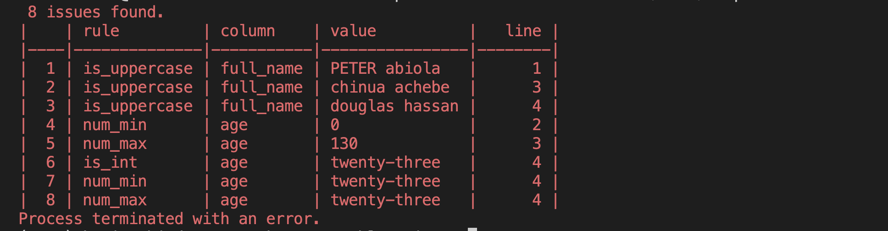

[](https://github.com/kehindeadewusi/csv-blueprint/actions/workflows/test.yml?query=branch%3Amain)


# CSV-Blueprint
A Python CSV validation tool that validates the records in a CSV file against a YAML schema. For some use case, it can also be run from a Docker container to make it language-agnostic.

Given a CSV file like this:

| full_name     | age |
| ------------- | --- |
| taiye christy | 45  |
| kobbie mainoo | 19  |

You can validate it with a schema like this:

```yaml
name: 'people file'

columns:
- name: full_name
  rules:
    not_empty: true
    is_trimmed: true
    is_lowercase: true
    is_uuid: true

- name: age
  rules:
    is_int: true
    num_min: 0
```

The v1 structure and rules are intentionally compatible and with the most important features from https://github.com/JBZoo/CSV-Blueprint which is written in PHP. Doing validation with the PHP version introduced considerable architectural changes to `our` data pipelines making this port required.

## Installation

```sh
pip install csv-blueprint
```

## Usage
The library include scripts that can be used from a command terminal, it can also be imported and used in code. To use it from the command line

```sh
validate-csv --csv path-to-csv-file --schema path-to-yaml-schema
```

You can also launch the validator from a docker container:

```sh
docker run --rm kehindeadewusi/csv-blueprint validate-csv --csv ./examples/sample-2.csv --schema ./examples/sample1.yaml
```



## Features
- CSV assertions based on a simple YAML schema
- Common off-the-shelve rules e.g. `is_int`, `is_empty` and many more.
- Easy to understand output
- Library integration into your Python code
- Use the Docker container for a language-agnostic integration.

## Rules

The available rules are included in the `examples/full.yaml` file.
